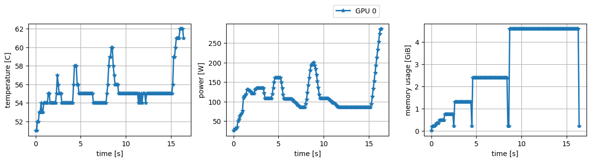

# GPU Monitor

This program records GPU temperature, power consumption, memory usage while executing programs on GPUs.
The output is written to a CSV file.
It also provides the following features:
- C++ API allows us to measure these metrics while running a function.
- C++ and Python methods for inserting messages to the CSV file.

## Requirements
- C++17 or later
  - This program uses `std::filesystem`

## Installation

Build:
```bash
git clone https://github.com/enp1s0/gpu_monitor --recursive
cd gpu_monitor
mkdir build
cd build
cmake .. -DCMAKE_INSTALL_PREFIX=/path/to/install
make -j4
make install
```

Set environment variables:
```
export PATH=/path/to/install/bin:$PATH
# When you use the C++ API, please set following environment variables:
export LIBRARY_PATH=/path/to/install/lib:$LIBRARY_PATH
export LD_LIBRARY_PATH=/path/to/install/lib:$LD_LIBRARY_PATH
export C_INCLUDE_PATH=/path/to/install/include:$C_INCLUDE_PATH
```

## Usage
```bash
gpu_monitor ./a.out
```

Some options are available to specify time interval and output file name.
```bash
gpu_monitor [-i interval(ms){default=100}] [-o output_file_name{default=gpu.csv}] [-g gpu_id{default=ALL}] [-r] target_command
```
- '-r' option turns on printing result message.
e.g.
```
##### GPU Monitoring result #####
-       time : 1.0 [s]
## GPU 0
-   max temp : 53.0 [C]
-  max power : 86.3 [W]
-    max mem : 3.81446e+00 [GB]
```

e.g.
```bash
gpu_monitor -i 100 -o report.csv -g 0,2,4 ./a.out
```

## Visualization

`scripts/mk_graph.py` visualizes the monitoring result. [[detail]](./scripts/)



## Insert messages to output file

### C++
The GPU Monitor API can insert messages to output file.

```cpp
// g++ -std=c++11 -I/path/to/gpu_monitor/include ...
#include <gpu_monitor/gpu_monitor.hpp>

int main() {
    // ...
    mtk::gpu_monitor::insert_message("Hello, world!");
}
```

### Python

See [Python extension](./python_extension) page.

## C++ Library
This library provides embedded profiling library.
```cpp
// main.cu
// Build: nvcc main.cu -L/path/to/build/or/install_dir/lib -lgpu_monitor -lnvidia-ml ...
#include <gpu_monitor/gpu_monitor.hpp>

void func() {
    const auto profiling_result = mtk::gpu_monitor::measure_power_consumption(
        [&]() {
            // some GPU code
            cudaDeviceSynchronize();
        },
        20, // interval [ms]
    );
}
```

See [sample code](./test/api.cu) for more information.

## License

MIT
